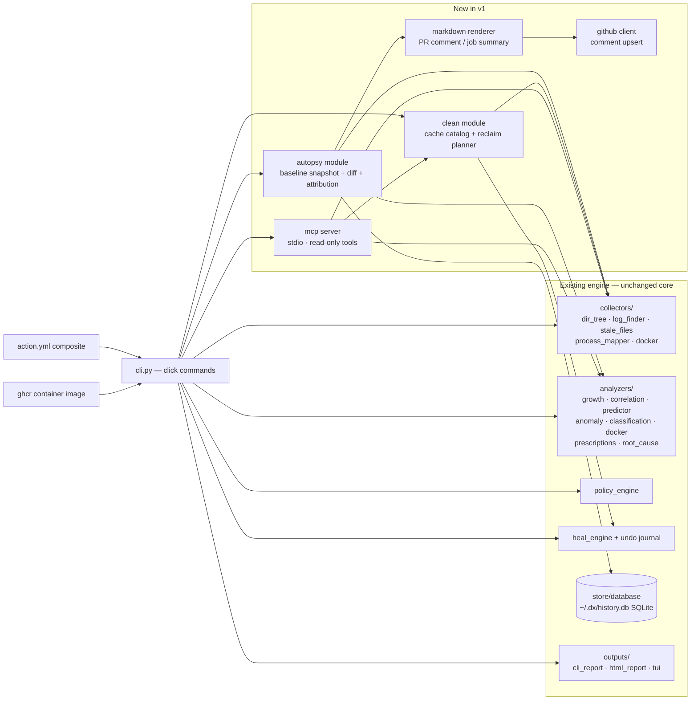

# dxcli — Technical Design Document

> **Status:** Draft v1.0 · 2026-07-13 · Companion to [PRD.md](PRD.md)
> Covers the existing engine plus the four v1 additions: **autopsy**, **clean**, **mcp**, **distribution**, and the deferred hosted service (sketch only).

---

## 1. Context & constraints

- **Scale expectations:** thousands of ephemeral CI invocations/week at 6 months (each stateless, seconds-long); dev-box installs in the low thousands. There is no server in v1 — "scale" means *cold-start latency and correctness*, not QPS.
- **Latency budgets:** guard < 30 s p95, snapshot < 60 s, clean dry-run < 20 s (PRD NFRs).
- **Team:** one maintainer, evenings. Every design choice biases toward *low operational surface*.
- **Compliance:** none applicable in v1 (no server, no PII collection, zero telemetry). Autopsy comments may expose private path names — treated as a documentation + `--redact` concern, not a compliance regime.
- **Budget envelope:** $0/month mandatory. ghcr + PyPI + Actions minutes are free for public repos.

## 2. High-level architecture



**Data flow, autopsy path (the growth loop):**
1. Workflow guard step: `dxcli snapshot --baseline /tmp/dx-baseline.json` (pre-build).
2. Build runs; fails.
3. `if: failure()` step: `dxcli autopsy --baseline /tmp/dx-baseline.json --pr-comment`.
4. Autopsy rescans, diffs against baseline, runs prescriptions on the growth set, renders markdown, upserts one PR comment (or `$GITHUB_STEP_SUMMARY` fallback).

Everything is synchronous and process-local. There are deliberately **no async boundaries** in v1.

## 3. Technology choices & trade-offs

| Decision | Chosen | Rejected | Why |
|---|---|---|---|
| Autopsy baseline format | Flat JSON file in the workspace (path passed between steps) | (a) SQLite `history.db` — runner-local, dies with the runner and complicates two-step wiring; (b) Actions cache — adds API dependency and eviction semantics | A file survives between steps of the same job trivially, is inspectable, and uploads as an artifact for free |
| PR comment mechanism | Direct GitHub REST call from Python via stdlib `urllib` against `api.github.com`, using `GITHUB_TOKEN` env | (a) `gh` CLI dependency — present on GitHub runners but not GitLab/dev boxes; (b) PyGithub dependency — large dep for two endpoints | Two endpoints (list comments, create/update comment) don't justify a dependency; stdlib keeps install light. **Assumption to verify in Phase 2: exact env vars (`GITHUB_REPOSITORY`, `GITHUB_REF`, event payload path) for PR number discovery.** |
| Comment upsert | Hidden HTML marker (`<!-- dxcli-autopsy -->`) + find-and-PATCH | Delete + recreate | Update avoids notification spam and preserves comment permalinks |
| Clean catalog | Declarative Python data (list of `CacheTarget` rules: path template, category, reversibility, detector) | YAML config file | Rules need small amounts of logic (e.g., "venv is stale if no activation in 90 days"); code with tests beats a DSL at this scale |
| Deletion executor | Existing `heal_engine` (realpath scoping, symlink rejection, undo journal) | New deletion code in clean module | Deletion safety code must exist exactly once; clean *plans*, heal *executes* |
| MCP implementation | Official `mcp` Python SDK, FastMCP-style decorators, stdio transport | (a) Hand-rolled JSON-RPC — needless protocol risk; (b) HTTP/SSE transport — server surface without a use case | Stdio is what Claude Code and desktop agents spawn; SDK tracks protocol changes. **UNVERIFIED: pin exact SDK version at Phase 3 start; API has historically moved.** |
| MCP dependency packaging | Optional extra: `pip install dxcli[mcp]` | Hard dependency | Keeps CI-guard install slim; agent users opt in |
| Container base | `python:3.12-slim` multi-stage, non-root user | Alpine (musl wheels pain for numpy), distroless (harder debugging) | numpy wheels + shell for composite-action debugging |
| Release auth | PyPI Trusted Publishing (OIDC from Actions) | Long-lived API token secret | No secret to leak; provenance for free |
| Action versioning | `v1` floating major tag + immutable `v1.x.y` tags | Only exact tags | Marketplace convention; users expect `@v1` |

## 4. Data model

**Existing (unchanged):** SQLite `~/.dx/history.db` — partition snapshots and per-directory size history keyed by path + timestamp; feeds predictor/growth analyzers. Fine to ~millions of rows; `prune` command already exists. Not used by CI paths (ephemeral runners) — by design.

**New: baseline snapshot JSON** (autopsy):

```json
{
  "schema": 1,
  "created_at": "2026-07-13T10:00:00Z",
  "partition": {"mountpoint": "/", "total_bytes": 0, "used_bytes": 0},
  "dirs": [{"path": "/home/runner/work", "size_bytes": 0}],
  "docker": {"images_bytes": 0, "build_cache_bytes": 0, "volumes_bytes": 0}
}
```

Versioned with `schema`; autopsy refuses newer-schema files with a clear error. Expected size: KBs (top-N dirs only, default N=200).

**New: clean plan** (in-memory, serialized by `--json`):

```json
{
  "targets": [{
    "category": "pip-cache",
    "path": "/home/u/.cache/pip",
    "size_bytes": 0,
    "reversible": false,
    "detector": "path-exists",
    "action": "delete-contents"
  }],
  "total_reclaimable_bytes": 0
}
```

## 5. API contracts

### CLI (exit codes are the public API)
| Command | Success | Failure semantics |
|---|---|---|
| `dxcli ci [PATH]` | 0 | 1 on critical pressure/policy (existing `ExitCode.CI_FAILURE`) |
| `dxcli snapshot --baseline F` | 0, writes F | validation/runtime codes from `runtime.ExitCode` |
| `dxcli autopsy --baseline F [--pr-comment] [--format markdown\|json]` | 0 even when growth found (it's a reporter, not a gate) | non-zero only on operational failure; **fork-PR token failure → warn + summary fallback + exit 0** |
| `dxcli clean [--yes] [--json] [--only C] [--skip C]` | 0 | non-zero if a requested deletion fails scope check (fail-closed) |
| `dxcli mcp [--allow PATH]...` | runs until stdin closes | protocol errors to stderr, never stdout (stdio transport owns stdout) |

### MCP tools (all read-only)
| Tool | Input schema | Returns |
|---|---|---|
| `disk_status` | `{}` | partitions with usage |
| `diagnose` | `{path, docker?: bool, classify?: bool}` | same JSON as `diagnose --json` |
| `diff` | `{path, hours}` | growth deltas |
| `predict` | `{path}` | time-to-full estimate |
| `clean_preview` | `{only?: [string]}` | clean plan (never executes) |

Rate limits/idempotency: N/A (local, read-only). Path allowlist enforced on every tool call, not just startup.

### GitHub REST usage (autopsy)
- `GET /repos/{owner}/{repo}/issues/{pr}/comments` (paginate, find marker)
- `POST .../comments` or `PATCH /repos/{owner}/{repo}/issues/comments/{id}`
- Token: workflow `GITHUB_TOKEN`, needs `pull-requests: write`; document the `permissions:` block in the Action README.

## 6. State management & consistency

- CLI is stateless per invocation except `~/.dx` (SQLite, atomic writes via `state.py`, already crash-safe).
- Baseline file: written atomically (temp + rename) so a crashed guard step can't leave a truncated baseline that poisons the autopsy.
- Comment upsert is **idempotent** by marker; re-running the failure step twice yields one comment.
- Retries: GitHub calls get 3 retries with backoff on 5xx/secondary-rate-limit; **never** retry deletion operations — a failed delete is inspected, not repeated blindly.

## 7. Failure modes

| Dependency | Slow | Down/absent | Corrupt |
|---|---|---|---|
| Docker socket | 10 s timeout, then proceed without docker section, note in output | Same — degrade, never fail the guard for missing Docker | Ignore unparseable `system df`, warn |
| GitHub API | Retry ×3 w/ backoff, then summary fallback | Summary fallback, exit 0 (autopsy must never turn a failed build red *twice*) | Treat non-2xx JSON as failure → fallback |
| Baseline file | — | Autopsy without baseline = absolute report (no deltas), labeled as such | Schema check; refuse with actionable error |
| `history.db` | — | Recreate (existing behavior) | Existing atomic-write protections |
| Filesystem walk | Existing thread pool + `--scan-threads`; per-entry error tolerance already in collectors | — | Skip unreadable entries, count them, report count |

## 8. Capacity & cost model

- **v1:** $0/month. Public-repo Actions minutes, PyPI, ghcr are free. Maintainer time is the only cost.
- **10x scale:** still $0 — every workload runs on the user's machine. The architecture cannot be broken by adoption; it can only be broken by *support load* (issues volume). Mitigation: issue templates + reproduction requirements in Phase 0.
- **Phase 5 hosted sketch (deferred):** FastAPI + Postgres (Neon/Fly free tier to start), snapshot ingest ≈ 2 KB/build → 1 GB holds ~500k builds; costs stay <$25/mo until ~thousands of active repos. Real costs are auth, billing, and on-call — which is exactly why it's gated.

## 9. Security architecture

- **No network by default** (see NFRs): the only sockets are Docker (local), GitHub API (opt-in flag), user webhooks (existing opt-in).
- **Deletion safety:** single choke point (heal engine): realpath containment, symlink-escape rejection, journal + undo for reversible classes; `clean` adds a category allowlist so arbitrary paths can't enter the plan.
- **Token handling:** `GITHUB_TOKEN` read from env only, never logged, never persisted; redact from any debug output.
- **Supply chain:** our workflows pin third-party actions by SHA; releases via OIDC Trusted Publishing; `pip-audit` + `bandit` gate merges; dependencies pinned via lock file for the container image. AI-generated code in deletion/scoping paths gets line-by-line human review (Supp-B provenance gate — see ROADMAP checkpoints).
- **MCP:** read-only tool surface + path allowlist; deletion deliberately not exposed to agents in v1 (an agent convincing itself to run `clean --yes` is a scenario we simply remove).

## 10. What we're deliberately NOT doing

- No plugin execution in CI paths (exists, stays opt-in and out of the story).
- No async/queueing/daemonization of autopsy — a 30-second synchronous step is the right shape.
- No config file proliferation: autopsy and clean are flag-driven; `config.yaml` stays for watch/targets.
- No premature abstraction of "CI providers": GitHub first-class, GitLab via documented recipe, nothing else.

## 11. Biggest regret risk

**Betting the wedge on PR comments while relying on `GITHUB_TOKEN` semantics we don't control.** If GitHub tightens default token permissions further (they've moved default to read-only before), the frictionless story becomes "add a permissions block", which halves conversion.
**Trigger to revisit:** if >30% of autopsy issue reports are token/permissions confusion, invest immediately in (a) a job-summary-first default and (b) a GitHub App variant of the commenter.

---

*Exit gate check (Phase 3): data model and build order understood; hard-to-reverse decisions identified (exit codes, JSON schemas, Action inputs, comment marker format — all public contracts once shipped). ✔*
